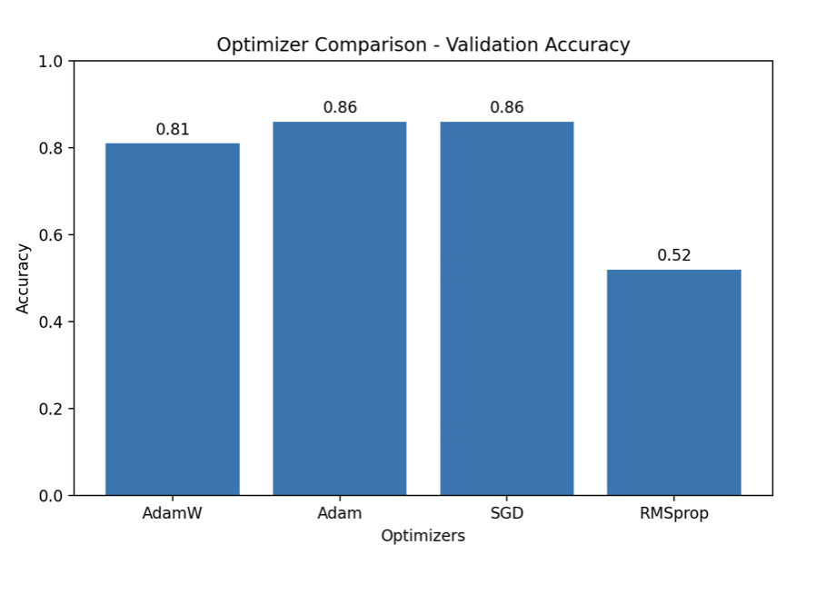
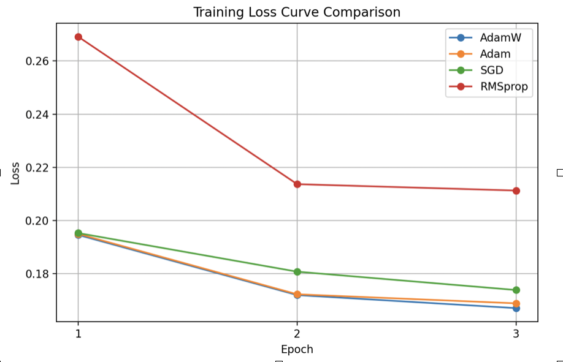

Optimizer-Aware Knowledge Distillation for Lightweight NLP Models

A transformer-based NLP optimization framework that transfers knowledge from BERT (Teacher Model) to DistilBERT (Student Model) using Knowledge Distillation for efficient sentiment classification.

This project benchmarks multiple optimizers (AdamW, Adam, SGD, RMSprop) to analyze their impact on training convergence, learning stability, and classification performance on the SST-2 sentiment analysis dataset.

Project Overview
Large transformer models such as BERT achieve strong NLP performance but are computationally expensive for deployment.

This project explores how knowledge distillation can compress large NLP models while maintaining predictive performance. Additionally, it evaluates whether optimizer selection influences the effectiveness of the distillation process.

The system transfers knowledge from a BERT teacher model to a lightweight DistilBERT student model, enabling more efficient inference with lower computational cost.

Key Features
* BERT → DistilBERT Knowledge Distillation
* Optimizer Benchmarking (AdamW, Adam, SGD, RMSprop)
* Sentiment Classification using SST-2 Dataset
* Distillation Loss + Cross Entropy Loss
* Training Loss & Accuracy Visualization
* Performance Evaluation using Accuracy, Precision, Recall, F1-score
* Confusion Matrix Analysis

System Architecture
Dataset (SST-2)
        ↓
Text Preprocessing & Tokenization
        ↓
Teacher Model (BERT)
        ↓
Soft Targets Generation
        ↓
Student Model (DistilBERT)
        ↓
Knowledge Distillation Training
        ↓
Optimizer Benchmarking
        ↓
Evaluation & Visualization

Repository Structure
optimizer-aware-knowledge-distillation/
│
├── data/
│   └── data_loader.py
│
├── models/
│   ├── teacher_model.py
│   ├── student_model.py
│   └── teacher_inference.py
│
├── training/
│   ├── distillation_train.py
│   ├── compare_optimizers.py
│   └── distillation_loss.py
│
├── evaluation/
│   └── evaluate_model.py
│
├── visualization/
│   └── visualize_results.py
│
├── notebooks/
│   └── experiment_runner.py
│
├── results/
│   ├── figures/
│   ├── metrics/
│   └── trained_student/
│
├── requirements.txt
└── [README.md](http://readme.md/)

Dataset
The project uses the SST-2 (Stanford Sentiment Treebank) dataset for binary sentiment classification.

* Task: Positive vs Negative Sentiment Classification
* Domain: Natural Language Processing (NLP)

Experimental Setup

Teacher Model
* BERT-base-uncased

Student Model
* DistilBERT-base-uncased

Optimizers Evaluated
* AdamW
* Adam
* SGD
* RMSprop

Loss Function
The student model is trained using a combination of:

* Distillation Loss (Soft Targets from Teacher Model)
* Cross Entropy Loss (Ground Truth Labels)

Results
The project evaluates optimizer performance using validation accuracy and training loss trends.
Dataset

The project uses the SST-2 (Stanford Sentiment Treebank) dataset for binary sentiment classification.

* Task: Positive vs Negative Sentiment Classification
* Domain: Natural Language Processing (NLP)

Experimental Setup

Teacher Model
* BERT-base-uncased

Student Model
* DistilBERT-base-uncased

Optimizers Evaluated
* AdamW
* Adam
* SGD
* RMSprop

Loss Function
The student model is trained using a combination of:

* Distillation Loss (Soft Targets from Teacher Model)
* Cross Entropy Loss (Ground Truth Labels)

Results
The project evaluates optimizer performance using validation accuracy and training loss trends.
| **Optimizer** | **Validation Accuracy** |
| --- | --- |
| AdamW | 81% |
| Adam | 86% |
| SGD | 86% |
| RMSprop | 52% |

Best Validation Accuracy Achieved: 86%

Key Findings
* Adam and SGD showed best convergence performance
* AdamW provided stable learning behavior
* RMSprop underperformed for this task
* Knowledge distillation successfully reduced model complexity while maintaining strong predictive performance

Sample Visualizations

Optimizer Comparison

Training Loss Curve

Tech Stack
Languages & Frameworks
* Python
* PyTorch
* Hugging Face Transformers

Libraries
* NumPy
* Pandas
* Matplotlib
* Scikit-learn

NLP Models
* BERT
* DistilBERT

Installation
git clone https://github.com/Tanishakumar26/optimizer-aware-knowledge-distillation.git

cd optimizer-aware-knowledge-distillation

pip install -r requirements.txt

Run Training
python training/distillation_train.py

Compare Optimizers
python training/compare_optimizers.py

Evaluate Model
python evaluation/evaluate_model.py

Future Improvements
* Hyperparameter optimization
* Multi-dataset benchmarking
* Model quantization for further compression
* Advanced transformer architectures

